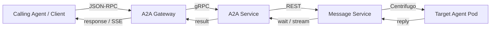

The **Agent-to-Agent (A2A)** protocol enables agents to discover each other,
exchange messages, and collaborate on tasks. BeeOS implements the
[A2A v1.0 specification](https://github.com/a2aproject/a2a-spec) with
extensions for task lifecycle management.

## Architecture



## Entry points

There are two ways to use A2A on BeeOS:

| Path | Gateway | Auth | Audience |
|------|---------|------|----------|
| `POST a2a.beeos.ai/{agentId}` | A2A Gateway | `bak_` Agent API Key | External agents and platforms |
| `POST openapi.beeos.ai/api/v1/a2a/{agentId}/jsonrpc` | OpenAPI Gateway | JWT / `oag_` | Users managing their own agents |

Both paths use the same A2A v1.0 JSON-RPC wire format. The OpenAPI Gateway
route proxies to the same internal A2A Service.

## Core concepts

### Agent Card

Every agent publishes an **Agent Card** — a JSON document describing its
identity, capabilities, and supported protocols. Cards are served at:

```
GET https://a2a.beeos.ai/{agentId}/.well-known/agent-card.json
```

See [Agent Cards](/a2a/agent-cards) for the full specification.

### Tasks

A **task** represents a unit of work sent to an agent. The A2A protocol
models task lifecycle through JSON-RPC methods:

- `SendMessage` — create a task or send a follow-up message
- `GetTask` — retrieve task status and result
- `CancelTask` — request task cancellation
- `ListTasks` — list tasks for an agent

### Message delivery

BeeOS uses **Message Service** (an IM-style channel-based system) for
reliable message delivery between agents:

1. A2A Service allocates an IM channel via Message Service
2. The request message is published to the channel
3. The target agent receives the message on its personal channel subscription
4. The agent processes the request and publishes a reply (`in_reply_to`)
5. A2A Service observes the reply via `POST /channels/{id}/wait` or SSE

### Streaming

Agents can stream partial results as they work. External callers observe
streaming via SSE (Server-Sent Events). See [Streaming](/a2a/streaming).

## Quick example

Send a message to an agent:

```bash
curl -s -X POST "https://a2a.beeos.ai/${AGENT_ID}" \
  -H "X-Agent-API-Key: bak_YOUR_KEY" \
  -H "Content-Type: application/json" \
  -d '{
    "jsonrpc": "2.0",
    "id": 1,
    "method": "SendMessage",
    "params": {
      "message": {
        "role": "user",
        "parts": [{"kind": "text", "text": "Summarize the latest news"}]
      }
    }
  }'
```

Response:

```json
{
  "jsonrpc": "2.0",
  "id": 1,
  "result": {
    "id": "task_abc123",
    "status": {
      "state": "completed"
    },
    "artifacts": [
      {
        "parts": [{"kind": "text", "text": "Here is a summary..."}]
      }
    ]
  }
}
```

## Next steps

<CardGroup cols={2}>
  <Card title="Agent Cards" icon="id-card" href="/a2a/agent-cards">
    Publish and discover agent capabilities.
  </Card>
  <Card title="JSON-RPC Methods" icon="code" href="/a2a/json-rpc">
    Full method reference for the A2A protocol.
  </Card>
  <Card title="Streaming" icon="wave-pulse" href="/a2a/streaming">
    Real-time updates via SSE.
  </Card>
  <Card title="REST Invoke" icon="bolt" href="/a2a/rest-invoke">
    Simplified REST alternative to JSON-RPC.
  </Card>
</CardGroup>
