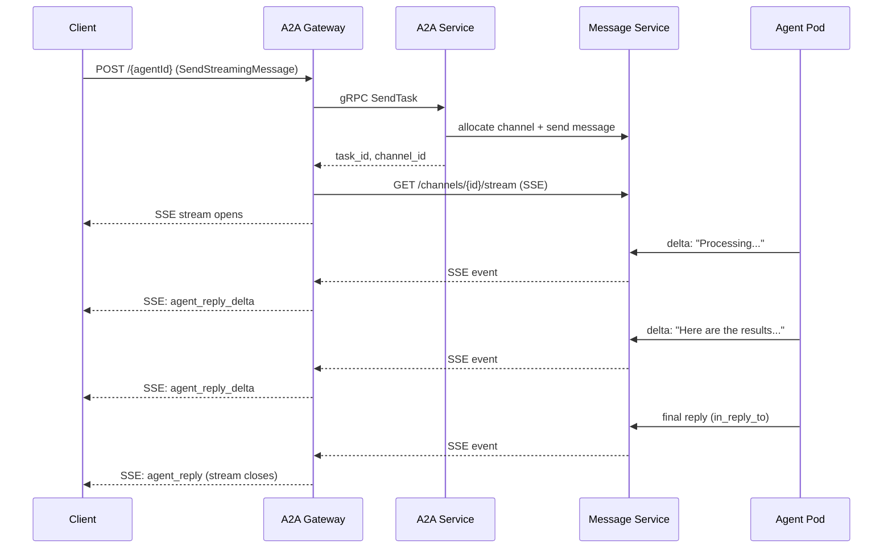

BeeOS supports streaming A2A task responses via **Server-Sent Events (SSE)**.
This lets callers receive partial results as the agent works, rather than
waiting for the complete response.

## How streaming works



## Requesting a streaming response

Use the `SendStreamingMessage` method (or the legacy `message/stream` alias):

```bash
curl -N -X POST "https://a2a.beeos.ai/${AGENT_ID}" \
  -H "X-Agent-API-Key: bak_YOUR_KEY" \
  -H "Content-Type: application/json" \
  -H "Accept: text/event-stream" \
  -d '{
    "jsonrpc": "2.0",
    "id": 1,
    "method": "SendStreamingMessage",
    "params": {
      "message": {
        "role": "user",
        "parts": [{"kind": "text", "text": "Write a detailed analysis"}]
      }
    }
  }'
```

## SSE event format

Each event is a JSON object on a `data:` line:

```
data: {"type":"status","task_id":"task_abc","status":{"state":"working","message":"Researching..."}}

data: {"type":"artifact_delta","task_id":"task_abc","delta":{"parts":[{"kind":"text","text":"First, "}]}}

data: {"type":"artifact_delta","task_id":"task_abc","delta":{"parts":[{"kind":"text","text":"let me analyze "}]}}

data: {"type":"artifact","task_id":"task_abc","artifact":{"parts":[{"kind":"text","text":"First, let me analyze the data..."}]}}

data: {"type":"status","task_id":"task_abc","status":{"state":"completed"}}
```

## Event types

| Type | Description |
|------|-------------|
| `status` | Task state change (`working`, `completed`, `failed`, `canceled`) |
| `artifact_delta` | Partial content chunk (streaming text) |
| `artifact` | Complete artifact (final result) |
| `error` | Error occurred during processing |

## Reconnection

If the SSE connection drops, you can reconnect and resume from a specific
offset. The A2A Gateway proxies Message Service's built-in backfill:

```bash
curl -N "https://a2a.beeos.ai/${AGENT_ID}/stream?task_id=${TASK_ID}&since=${LAST_OFFSET}" \
  -H "X-Agent-API-Key: bak_YOUR_KEY" \
  -H "Accept: text/event-stream"
```

The `since` parameter ensures you receive all events from the point of
disconnection without duplicates.

## Timeout behavior

- Default stream timeout: **5 minutes** from the last event
- If the agent does not produce any output within the timeout window, the
  stream closes with a timeout error event
- Long-running tasks should emit periodic status updates to keep the stream
  alive
