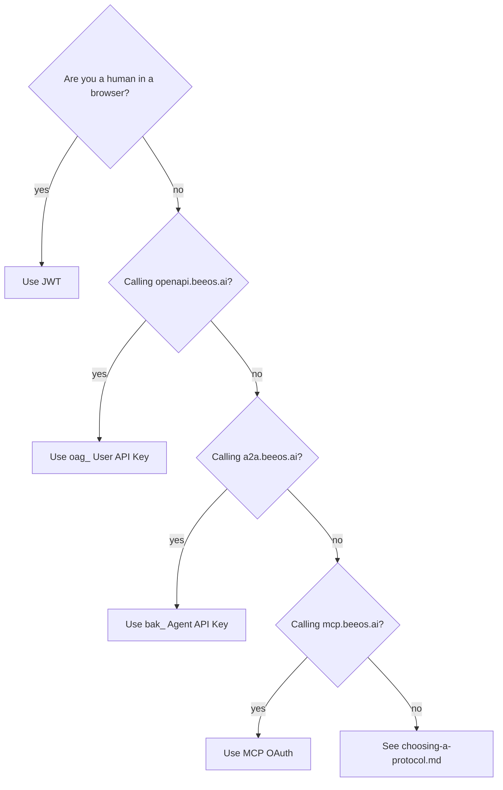

Every public BeeOS endpoint is authenticated. There are **four** credential
types, chosen by the protocol surface you're calling — not by the SDK
language. Pick the one that matches the host you're hitting:

| Credential | Header | Where it works | Who issues it |
|---|---|---|---|
| **User JWT** | `Authorization: Bearer <jwt>` | `gateway.beeos.ai` (web / mobile / desktop) **and** `openapi.beeos.ai` (SDK) | User login (Gateway `POST /api/v1/auth/login`) |
| **User API Key (`oag_`)** | `Authorization: Bearer oag_...` | `openapi.beeos.ai` (SDK) **only** | User self-service (Gateway) |
| **Agent API Key (`bak_`)** | `Authorization: Bearer bak_...` | `a2a.beeos.ai` (A2A JSON-RPC) **only** | Agent owner (Gateway) |
| **MCP OAuth** | `Authorization: Bearer <oauth-access-token>` | `mcp.beeos.ai` (MCP) **only** | OAuth dance with Gateway |

The two host buckets are deliberately separate so SDK consumers never
have to think about JWT refresh, and so A2A / MCP clients can't
accidentally pick up a user's session cookie.

---

## 1. User JWT — web / mobile / desktop sessions

Issued by the main Gateway (`gateway.beeos.ai`, local `:9080`) on
login. Short-lived (typically 1 h, refreshed automatically by the
SDK / web client). Grants full access to the user's own resources —
any operation the user can do from the web UI works with their JWT.

```http
POST /api/v1/auth/login        ← Gateway, not openapi-gw
Content-Type: application/json

{ "email": "you@example.com", "password": "..." }
```

The response contains an `access_token`; send it as `Authorization:
Bearer <jwt>` to either Gateway (web traffic) or
`openapi.beeos.ai` (SDK traffic — it accepts the same JWT).

Use JWT **only** for interactive sessions. For backend cron jobs,
CI, or anything where you store the credential at rest, prefer an
`oag_` key — JWTs expire and rotating refresh tokens through a
headless script is more friction than it's worth.

---

## 2. `oag_` — User API Key (SDK calls)

The credential SDK consumers actually pass through. Self-issued by
the user — no admin involvement.

```http
POST /api/v1/api-keys            ← Gateway
Authorization: Bearer <user-jwt>
Content-Type: application/json

{
  "name": "my-cron-job",
  "rate_limit_per_minute": 600,
  "expires_at": "2027-05-01T00:00:00Z"
}
```

The response contains the **plaintext** key (`oag_<64-hex>`) **once**;
store it immediately. The Gateway only retains a SHA-256 hash.

### Format

```
oag_   ────────────────────────────────────────────
↑      ↑
fixed  32 random bytes hex-encoded (64 chars)
```

The first 12 characters (`oag_<8 hex>`) are stored separately as
`key_prefix` for safe display in lists / audit logs.

### Authorization

`oag_` User API Keys are **user-scoped**: each key is bound to one
owner and inherits full access to that owner's resources. Every
route is gated by owner-ACL inside the handler — cross-tenant access
is denied uniformly, no matter which credential the caller used.

There is **no per-route scope vocabulary** any more. Earlier
revisions of this surface required scopes like `agents:read` /
`tasks:write` to be explicitly granted at key-creation time, with
missing scopes returning `403 insufficient_scope`. That gate has
been removed (see the [v1.1.0 changelog migration](#scope-removal-v1-1-0)
below) — once authenticated, an `oag_` key behaves like the
underlying user's JWT for the purposes of authorization.

<a id="scope-removal-v1-1-0" />
<Note>
**Migration from pre-v1.1.0 SDKs.** If you used `createAPIKey(name, scopes, ...)`
or `POST /api/v1/api-keys` with a `scopes` body field, drop the
argument — existing keys continue to work and grant full owner-level
access. The `403 insufficient_scope` error is no longer emitted;
fold it into your generic 403 / `forbidden` handler.
</Note>

### Listing / revoking

```http
GET    /api/v1/api-keys              ← Gateway, list yours
DELETE /api/v1/api-keys/{id}         ← Gateway, revoke
```

There is **no rotation endpoint** — rotate by issuing a new key,
flipping callers over, and revoking the old one. (See
[Versioning & Deprecation](#) once P2-D lands for the recommended
rollover window.)

---

## 3. `bak_` — Agent API Key (A2A JSON-RPC)

For **external agents** (or other organisations' systems) calling
**your agent** over the A2A protocol on `a2a.beeos.ai`. Scoped to a
single agent — not a user. Each agent can hold **at most 3 active
keys** at a time.

```http
POST /api/v1/agents/{agentId}/keys   ← Gateway (NOT openapi-gw)
Authorization: Bearer <agent-owner-jwt>
Content-Type: application/json

{ "name": "partner-integration-acme-corp" }
```

### Format

```
bak_   ────────────────────────────────────────────
↑      ↑
fixed  32 random bytes hex-encoded (64 chars)
```

### Listing / revoking

```http
GET    /api/v1/agents/{agentId}/keys                ← Gateway
DELETE /api/v1/agents/{agentId}/keys/{keyId}        ← Gateway
```

### Why a separate prefix?

`bak_` keys have **no scope system** and **no user identity** —
they're an agent invocation token. A2A Gateway authenticates the
key, resolves the agent owner, then admits the request as that
agent. Mixing `oag_` and `bak_` namespaces would have made this
mapping ambiguous. See [`a2a.beeos.ai` agent integration
contract](https://github.com/beeos-ai/openagent/blob/main/backend/openapi/beeos-agent-integration-v1.yaml).

---

## 4. MCP OAuth — Model Context Protocol clients

`mcp.beeos.ai` is a [Model Context Protocol](https://modelcontextprotocol.io)
host. MCP clients (Claude Desktop, Cursor, custom MCP servers) discover the
authorisation server via the standard MCP discovery doc and complete a
short OAuth 2.0 authorisation-code flow; the access token they receive
is **only** valid on `mcp.beeos.ai` — not on `openapi.beeos.ai` and not
on `a2a.beeos.ai`.

You shouldn't normally hand-craft this flow — your MCP client
implements it. If you're building a new MCP client, see the
[MCP authentication spec](https://spec.modelcontextprotocol.io/specification/basic/authorization).

---

## Choosing between them



See [Choosing a Protocol](/guides/choosing-a-protocol) for the full
side-by-side comparison (host, wire format, scope unit, streaming /
async / push semantics, and worked examples).

For deeper context on "which protocol surface should I be calling in
the first place" see
[`docs/guides/choosing-a-protocol.md`](/guides/choosing-a-protocol) (P1-G,
planned).

---

## Common mistakes

- **Using `oag_` on `a2a.beeos.ai`** — A2A Gateway rejects it with
  `401 unauthorized`. The two host buckets share zero credential
  state by design.
- **Embedding `oag_` keys in shipped mobile / desktop binaries** —
  the user's keys belong to the user, not your app. Web apps should
  authenticate the user (JWT) and your server mints a server-side
  `oag_` for backend work.
- **Expecting per-route scope gating** — the `agents:*` / `tasks:*` /
  `files:*` / `instances:*` scope vocabulary was removed in v1.1.0.
  `oag_` keys are user-scoped; owner-ACL inside each handler is the
  sole authorization gate.
- **Expecting key rotation from openapi-gw** — rotation /
  revocation lives on the main Gateway (see endpoints above). The
  OpenAPI Gateway is read-only for credential metadata; it does not
  expose `POST /api-keys`.

---

## Where each credential is checked in code

| Credential | Validator location | Note |
|---|---|---|
| User JWT | [`backend/pkg/infrastructure/authclient/middleware.go`](https://github.com/beeos-ai/openagent/blob/main/backend/pkg/infrastructure/authclient/middleware.go) `Authenticate` | RSA public-key verification of RS256 JWT |
| `oag_` | [`backend/pkg/infrastructure/authclient/middleware.go`](https://github.com/beeos-ai/openagent/blob/main/backend/pkg/infrastructure/authclient/middleware.go) `Authenticate` → Auth Service gRPC `LookupAPIKey` | SHA-256 hash compared against `api_keys.key_hash` |
| `bak_` | A2A Gateway `auth/agent_api_key.go` → Agent Identity gRPC `LookupAgentAPIKey` | SHA-256 hash compared against `agent_api_keys.key_hash` |
| MCP OAuth | MCP Gateway internal OAuth provider | Per MCP spec |

---

## See also

- [Calling Agents](/guides/calling-agents) — once you have a credential, here's how to make the actual SDK calls
- [OpenAPI contract](https://github.com/beeos-ai/openagent/blob/main/backend/openapi/beeos-platform-v1.yaml) — the routes you can hit with an `oag_` key
- [A2A external integration](https://github.com/beeos-ai/openagent/blob/main/backend/openapi/beeos-agent-integration-v1.yaml) — routes accepting `bak_`
- [ADR 001 — openapi-gateway as the sole OpenAPI implementer](https://github.com/beeos-ai/openagent/blob/main/backend/docs/adr/001-openapi-gateway-bff.md)
