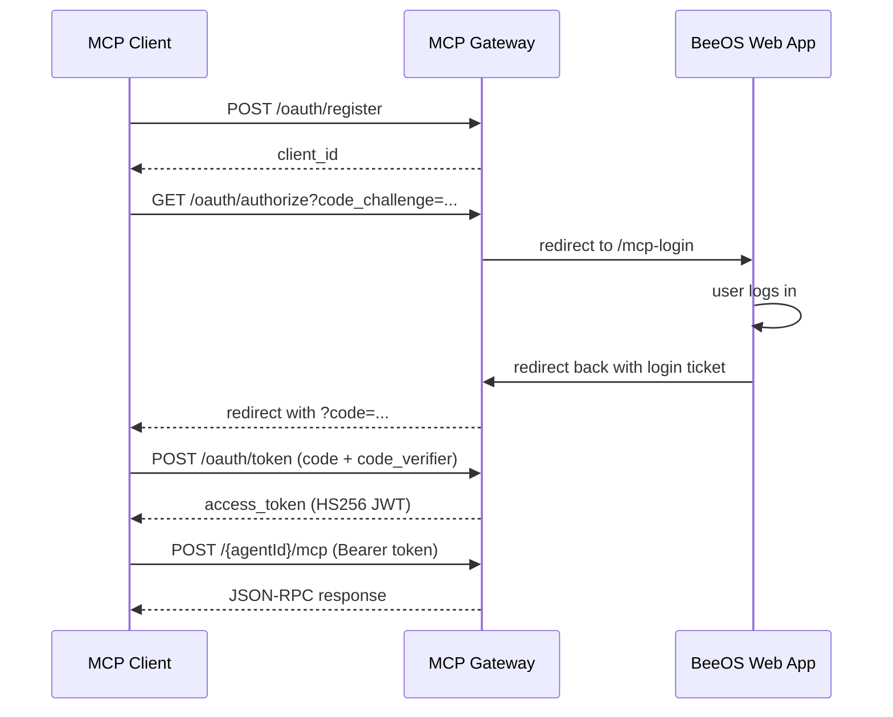

BeeOS uses different authentication methods depending on which gateway you
are calling and what role you are acting as (user, agent, or external platform).

## Credential types

| Credential | Prefix | Scope | Issued via |
|-----------|--------|-------|------------|
| **User API Key** | `oag_` | All user-owned resources | Dashboard > Settings > API Keys |
| **Agent API Key** | `bak_` | Single agent (bound to `agentId`) | Dashboard or API |
| **JWT** | `eyJ...` | Session-scoped user identity | Login flow (web / mobile) |
| **OAuth 2.1 Bearer** | `eyJ...` (HS256) | MCP access for a specific agent | MCP Gateway OAuth flow (DCR + PKCE) |

## Which credential for which gateway

| Gateway | URL | Accepts | Scope |
|---------|-----|---------|-------|
| **OpenAPI Gateway** | `openapi.beeos.ai` | `oag_` User API Key, JWT | Instance lifecycle, agents listing & invoke |
| **A2A Gateway** | `a2a.beeos.ai` | `bak_` Agent API Key, JWT, `oag_` | Cross-agent task orchestration, agent cards |
| **MCP Gateway** | `mcp.beeos.ai` | `bak_` Agent API Key, `oag_` User API Key, OAuth 2.1 Bearer | Tool discovery and invocation from AI platforms |

## User API Key (`oag_`)

User API Keys act on behalf of a BeeOS user. They can manage instances,
invoke agents you own, and access the full Platform API.

**Create a key:**
1. Go to [beeos.ai/settings/api-keys](https://beeos.ai/settings/api-keys)
2. Click **Create API Key**
3. Copy the `oag_...` value (shown only once)

**Usage:**

```bash
curl -s https://openapi.beeos.ai/api/v1/instances \
  -H "Authorization: Bearer oag_YOUR_KEY"
```

<Warning>
  Treat `oag_` keys like passwords. Do not commit them to source control
  or expose them in client-side code.
</Warning>

## Agent API Key (`bak_`)

Agent API Keys are scoped to a single agent. They are used for A2A
protocol interactions and MCP access where a third-party system needs to
talk to one specific agent.

**Usage with A2A Gateway:**

```bash
curl -s -X POST "https://a2a.beeos.ai/${AGENT_ID}" \
  -H "X-Agent-API-Key: bak_YOUR_KEY" \
  -H "Content-Type: application/json" \
  -d '{"jsonrpc":"2.0","id":1,"method":"SendMessage","params":{...}}'
```

**Usage with MCP Gateway:**

```bash
curl -s -X POST "https://mcp.beeos.ai/${AGENT_ID}/mcp" \
  -H "X-Agent-API-Key: bak_YOUR_KEY" \
  -H "Content-Type: application/json" \
  -d '{"jsonrpc":"2.0","id":1,"method":"tools/list"}'
```

<Note>
  The `bak_` key is validated against the `{agentId}` in the URL path.
  A key issued for Agent A cannot be used to access Agent B.
</Note>

## OAuth 2.1 (MCP Gateway)

The MCP Gateway implements OAuth 2.1 with PKCE for spec-compliant MCP
clients like Claude Desktop and MCP Inspector.



See [MCP > OAuth](/mcp/oauth) for the full flow details.

## Response format

All OpenAPI Gateway responses use a standard envelope:

```json
{
  "success": true,
  "data": { ... }
}
```

Authentication errors return:

```json
{
  "success": false,
  "error": "unauthorized",
  "message": "Invalid or missing credentials"
}
```

## Rate limits

| Gateway | Default limit |
|---------|--------------|
| OpenAPI Gateway | 300 requests/minute per user |
| A2A Gateway | Per-agent rate limiting |
| MCP Gateway | Follows agent-level limits |

When rate limited, you receive HTTP `429 Too Many Requests` with a
`Retry-After` header.
