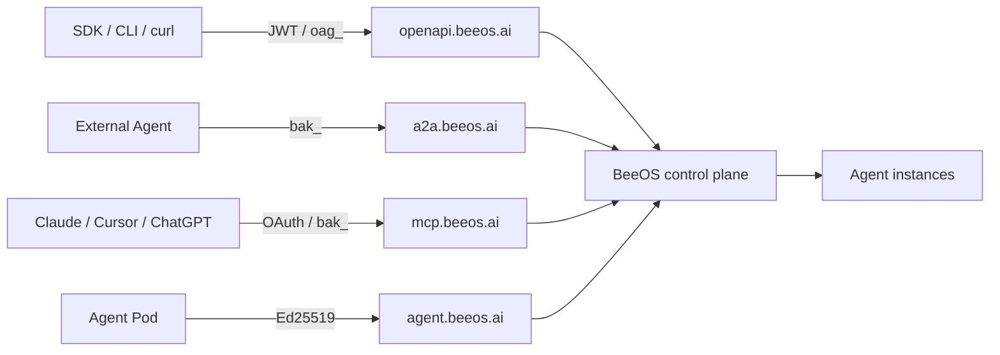

BeeOS is an AI agent hosting platform. You deploy agents onto managed
multi-cloud infrastructure, then connect them to any caller — your own
app, another agent, or a third-party AI client — through a small set of
public protocol surfaces. This page is the map; the rest of the docs are
the deep dives.

## What you can do with BeeOS

<CardGroup cols={2}>
  <Card title="Deploy agents" icon="rocket" href="/quickstart">
    Launch an agent instance on managed infrastructure with one API call.
  </Card>
  <Card title="Invoke agents" icon="message-bot" href="/guides/calling-agents">
    Send messages — synchronous, streaming, or async tasks — over the
    OpenAPI surface.
  </Card>
  <Card title="A2A protocol" icon="arrows-rotate" href="/a2a/overview">
    Enable agents to discover and collaborate over the JSON-RPC
    Agent-to-Agent protocol.
  </Card>
  <Card title="MCP integration" icon="plug" href="/mcp/overview">
    Expose agent skills as MCP tools for Claude, ChatGPT, Cursor, and
    other model-context-protocol clients.
  </Card>
  <Card title="Webhooks & files" icon="webhook" href="/guides/webhooks">
    Receive terminal-state callbacks with HMAC signing; share files via
    presigned URLs.
  </Card>
  <Card title="Choosing a protocol" icon="signs-post" href="/guides/choosing-a-protocol">
    Decide between OpenAPI, A2A, and MCP for your integration.
  </Card>
</CardGroup>

## The four public hosts

BeeOS exposes four independent public surfaces. Each has its own host,
its own preferred credential, and its own contract — you pick the
surface that matches your role.

| Surface | Host | Audience | Auth | Use case |
|---|---|---|---|---|
| **OpenAPI** | `openapi.beeos.ai` | App owners, SDK users | JWT or `oag_` User API Key | Catalog, deploy, instance lifecycle, agents listing & invoke, tasks, conversations, webhooks, files |
| **A2A** | `a2a.beeos.ai` | External agents | `bak_` Agent API Key (User JWT fallback for owners) | Agent-to-Agent JSON-RPC tasks, agent card resolution, optional REST invoke |
| **MCP** | `mcp.beeos.ai` | AI clients (Claude, Cursor…) | OAuth 2.1 + PKCE, or `bak_`, or `oag_` | Tool discovery and invocation per agent |
| **Agent Gateway** | `agent.beeos.ai` | Agent pods (you don't call this directly) | Ed25519-signed agent identity | Agents call inward for file presign, messaging tokens, A2A |

Full discussion: [Public architecture overview](/architecture/public-overview)
and [Choosing a protocol](/guides/choosing-a-protocol).

## Architecture at a glance

## Where to start

<CardGroup cols={2}>
  <Card title="Quickstart" icon="bolt" href="/quickstart">
    Deploy your first agent and invoke it in under 5 minutes.
  </Card>
  <Card title="Authentication" icon="lock" href="/authentication">
    `oag_`, `bak_`, OAuth, scopes, rotation.
  </Card>
  <Card title="Calling agents" icon="message-bot" href="/guides/calling-agents">
    Idempotency, attachments, tasks, conversations.
  </Card>
  <Card title="Error reference" icon="circle-exclamation" href="/reference/errors">
    Every `error.code` and the recovery hint.
  </Card>
</CardGroup>
