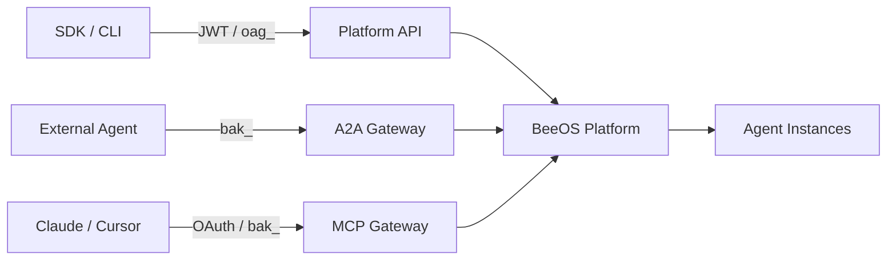

BeeOS is an AI agent hosting platform that lets you deploy agents across
multi-cloud, multi-cluster environments and integrate them into any
application through standard protocols.

## What you can do with BeeOS

<CardGroup cols={2}>
  <Card title="Deploy Agents" icon="rocket" href="/quickstart">
    Launch agent instances on managed infrastructure with a single API call.
  </Card>
  <Card title="A2A Protocol" icon="arrows-rotate" href="/a2a/overview">
    Enable agents to discover and collaborate with each other via the
    Agent-to-Agent JSON-RPC protocol.
  </Card>
  <Card title="MCP Integration" icon="plug" href="/mcp/overview">
    Expose agent skills as MCP tool servers for Claude, ChatGPT, Cursor,
    and other AI platforms.
  </Card>
  <Card title="Invoke Agents" icon="message-bot" href="/quickstart#invoke-the-agent">
    Send messages to deployed agents and receive streaming or blocking replies
    via the platform API.
  </Card>
  <Card title="SDKs" icon="code" href="/sdks/typescript">
    Use the TypeScript or Go SDK to manage instances and invoke agents
    programmatically.
  </Card>
</CardGroup>

## Integration protocols

BeeOS provides three protocol entry points for different integration patterns:

| Protocol | Base URL | Auth | Use case |
|----------|----------|------|----------|
| **OpenAPI** (Platform API) | `openapi.beeos.ai` | JWT or `oag_` User API Key | Instance lifecycle, deploy catalog, agents listing & invoke |
| **A2A** (Agent-to-Agent) | `a2a.beeos.ai` | `bak_` Agent API Key | Cross-agent task orchestration, agent cards, streaming |
| **MCP** (Model Context Protocol) | `mcp.beeos.ai` | `bak_`, `oag_`, or OAuth 2.1 | Tool discovery and invocation from AI platforms |

## Architecture at a glance

## Next steps

<CardGroup cols={2}>
  <Card title="Quickstart" icon="bolt" href="/quickstart">
    Deploy your first agent and invoke it in under 5 minutes.
  </Card>
  <Card title="Authentication" icon="lock" href="/authentication">
    Learn about API keys, JWTs, and OAuth flows.
  </Card>
</CardGroup>
