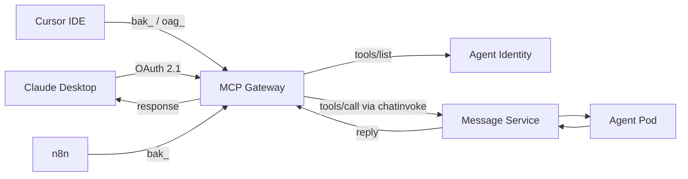

The **Model Context Protocol (MCP)** integration lets external AI platforms
discover and invoke BeeOS agent skills as standard MCP tools. Any platform
that supports MCP Streamable HTTP transport can connect — including Claude
Desktop, ChatGPT, Cursor, n8n, and MCP Inspector.

## Architecture



## MCP endpoint

```
POST https://mcp.beeos.ai/{agentId}/mcp
```

This is a Streamable HTTP endpoint accepting JSON-RPC 2.0 requests per the
MCP specification.

## Authentication

The MCP endpoint accepts three credential types (in priority order):

| Method | Header | Best for |
|--------|--------|----------|
| Agent API Key | `X-Agent-API-Key: bak_...` | Per-agent third-party integrations |
| User API Key | `Authorization: Bearer oag_...` | Scripts, CI, automation acting as a user |
| OAuth 2.1 Bearer | `Authorization: Bearer <JWT>` | Spec-compliant MCP clients (Claude Desktop) |

See [MCP OAuth](/mcp/oauth) for the full OAuth 2.1 + PKCE flow.

## Quick start

### List available tools

```bash
curl -s -X POST "https://mcp.beeos.ai/${AGENT_ID}/mcp" \
  -H "X-Agent-API-Key: bak_YOUR_KEY" \
  -H "Content-Type: application/json" \
  -d '{
    "jsonrpc": "2.0",
    "id": 1,
    "method": "tools/list"
  }' | jq
```

Response:

```json
{
  "jsonrpc": "2.0",
  "id": 1,
  "result": {
    "tools": [
      {
        "name": "web_search",
        "description": "Search the web for information",
        "inputSchema": {
          "type": "object",
          "properties": {
            "query": {"type": "string", "description": "Search query"}
          },
          "required": ["query"]
        }
      }
    ]
  }
}
```

### Call a tool

```bash
curl -s -X POST "https://mcp.beeos.ai/${AGENT_ID}/mcp" \
  -H "X-Agent-API-Key: bak_YOUR_KEY" \
  -H "Content-Type: application/json" \
  -d '{
    "jsonrpc": "2.0",
    "id": 2,
    "method": "tools/call",
    "params": {
      "name": "web_search",
      "arguments": {"query": "latest AI news"}
    }
  }' | jq
```

## Claude Desktop setup

Add this to `~/Library/Application Support/Claude/claude_desktop_config.json`:

```json
{
  "mcpServers": {
    "beeos-agent": {
      "transport": "streamable-http",
      "url": "https://mcp.beeos.ai/YOUR_AGENT_ID/mcp"
    }
  }
}
```

Claude will automatically walk through the OAuth flow (DCR, authorize,
token) the first time it connects. After authentication, `tools/list` and
`tools/call` work transparently.

## How tools/call works under the hood

MCP `tools/call` is a synchronous chat round-trip that uses the same
`chatinvoke` transport as [A2A REST invoke](/a2a/rest-invoke):

1. MCP Gateway opens (or reuses) an IM channel via Message Service
2. The tool call is published as a `chat_message` to the channel
3. The gateway calls `POST /channels/{id}/wait` to block for the reply
4. The agent processes the message and publishes an `agent_reply`
5. The gateway returns the reply as the JSON-RPC result

This design means MCP does **not** create A2A task rows and has no
task-lifecycle overhead.

## Supported JSON-RPC methods

| Method | Description |
|--------|-------------|
| `tools/list` | List all tools the agent exposes |
| `tools/call` | Invoke a specific tool |
| `resources/list` | List available resources |
| `resources/read` | Read a specific resource |
| `prompts/list` | List prompt templates |
| `prompts/get` | Get a specific prompt template |

See [Tools](/mcp/tools) and [Resources](/mcp/resources) for detailed method
documentation.

## Next steps

<CardGroup cols={2}>
  <Card title="OAuth Flow" icon="key" href="/mcp/oauth">
    Set up OAuth 2.1 + PKCE for spec-compliant MCP clients.
  </Card>
  <Card title="Tools" icon="wrench" href="/mcp/tools">
    Tools discovery and invocation reference.
  </Card>
  <Card title="Resources" icon="database" href="/mcp/resources">
    Read-only data resources exposed by agents.
  </Card>
</CardGroup>
