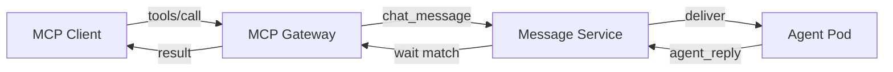

<Info>
  For the MCP host's auth, endpoint layout, and choice-vs-other-protocols
  guidance, start with [MCP overview](/mcp/overview). This page is the
  field-by-field reference for the `tools/*` methods.
</Info>

MCP tools let external AI platforms discover what an agent can do and
invoke specific capabilities. BeeOS agents automatically expose their
registered skills as MCP tools.

## Attachments

`tools/call` accepts an `attachments` array in the tool arguments —
each element is `{ file_id, filename?, content_type? }`. The MCP
Gateway resolves `file_id` to a presigned download URL and forwards it
to the agent as part of the [`chat_message`](/architecture/public-overview)
envelope (the same shape as OpenAPI `invokeAgent` and A2A `FilePart`).
Upload the file first via
`POST /api/v1/files/presign-upload` on `openapi.beeos.ai` (or the
TypeScript SDK's `FilesApi`).

## Idempotency

Pass `idempotency_key` inside the tool arguments to make `tools/call`
safe to retry. Repeat the same key within the TTL window
([ADR 0021](https://github.com/beeos-ai/openagent/blob/main/backend/docs/adr/0021-idempotency-key-ttl.md))
to receive the cached response without re-invoking the agent.

```json
{
  "jsonrpc": "2.0",
  "id": 42,
  "method": "tools/call",
  "params": {
    "name": "summarize_pdf",
    "arguments": {
      "attachments": [{ "file_id": "file_abc123", "filename": "q3.pdf" }],
      "idempotency_key": "user_7:q3_summary"
    }
  }
}
```

## HMAC-signed callbacks

When a tool invocation triggers a webhook (e.g. for long-running
tasks), the delivery is HMAC-SHA256 signed using the secret registered
on the webhook. See [Webhooks § HMAC signing](/guides/webhooks#6-hmac-signing-p2-a)
for the canonical signing contract — identical across OpenAPI, A2A,
and MCP surfaces.

## tools/list

Discover all tools an agent offers.

**Request:**

```json
{
  "jsonrpc": "2.0",
  "id": 1,
  "method": "tools/list"
}
```

**Response:**

```json
{
  "jsonrpc": "2.0",
  "id": 1,
  "result": {
    "tools": [
      {
        "name": "web_search",
        "description": "Search the web for current information on any topic.",
        "inputSchema": {
          "type": "object",
          "properties": {
            "query": {
              "type": "string",
              "description": "The search query"
            },
            "max_results": {
              "type": "integer",
              "description": "Maximum number of results to return",
              "default": 5
            }
          },
          "required": ["query"]
        }
      },
      {
        "name": "screenshot",
        "description": "Take a screenshot of the current browser or desktop view.",
        "inputSchema": {
          "type": "object",
          "properties": {}
        }
      }
    ]
  }
}
```

### Tool schema

Each tool in the response follows this structure:

| Field | Type | Description |
|-------|------|-------------|
| `name` | string | Unique tool identifier |
| `description` | string | Human-readable description of what the tool does |
| `inputSchema` | object | JSON Schema describing the tool's input parameters |

## tools/call

Invoke a specific tool on the agent.

**Request:**

```json
{
  "jsonrpc": "2.0",
  "id": 2,
  "method": "tools/call",
  "params": {
    "name": "web_search",
    "arguments": {
      "query": "BeeOS AI agent platform",
      "max_results": 3
    }
  }
}
```

**Response:**

```json
{
  "jsonrpc": "2.0",
  "id": 2,
  "result": {
    "content": [
      {
        "type": "text",
        "text": "Here are the top 3 results for 'BeeOS AI agent platform':\n\n1. ..."
      }
    ]
  }
}
```

### tools/call params

| Field | Type | Required | Description |
|-------|------|----------|-------------|
| `name` | string | yes | The tool name from `tools/list` |
| `arguments` | object | yes | Arguments matching the tool's `inputSchema` |

### Result content types

The `result.content` array can contain:

| Type | Description |
|------|-------------|
| `text` | Plain text result |
| `image` | Base64-encoded image with MIME type |
| `resource` | Reference to a resource URI |

## How tools/call works

Under the hood, `tools/call` is a synchronous chat round-trip:

1. MCP Gateway converts the tool call into a `chat_message` envelope
2. The message is published to an IM channel via Message Service
3. The gateway calls `POST /channels/{id}/wait` with `in_reply_to` matching
4. The agent processes the tool call and publishes an `agent_reply`
5. The gateway extracts the reply text and returns it as MCP content



## Multi-turn context

By default, each `tools/call` creates a new IM channel. To maintain
conversation context across multiple tool calls, the MCP Gateway tracks
`Mcp-Session-Id` headers as defined by the MCP spec. Calls within the
same session share the same underlying IM channel, allowing the agent
to access prior conversation history.

## Timeout

`tools/call` has a default timeout of **60 seconds**. If the agent does
not reply within this window, the gateway returns a JSON-RPC error:

```json
{
  "jsonrpc": "2.0",
  "id": 2,
  "error": {
    "code": -32003,
    "message": "Agent reply timeout"
  }
}
```

## Error handling

| Error code | Meaning |
|-----------|---------|
| `-32601` | Tool not found (check `tools/list`) |
| `-32602` | Invalid arguments (check `inputSchema`) |
| `-32003` | Agent timeout |
| `-32603` | Internal error |

## Example: full flow

```bash
# 1. List tools
curl -s -X POST "https://mcp.beeos.ai/${AGENT_ID}/mcp" \
  -H "X-Agent-API-Key: bak_YOUR_KEY" \
  -H "Content-Type: application/json" \
  -d '{"jsonrpc":"2.0","id":1,"method":"tools/list"}' | jq '.result.tools[].name'

# 2. Call a tool
curl -s -X POST "https://mcp.beeos.ai/${AGENT_ID}/mcp" \
  -H "X-Agent-API-Key: bak_YOUR_KEY" \
  -H "Content-Type: application/json" \
  -d '{
    "jsonrpc":"2.0",
    "id":2,
    "method":"tools/call",
    "params":{
      "name":"web_search",
      "arguments":{"query":"BeeOS"}
    }
  }' | jq '.result.content[0].text'
```
