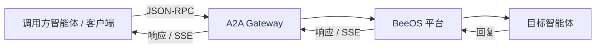

**Agent-to-Agent（A2A）** 协议使智能体能够相互发现、交换消息并协作完成任务。
BeeOS 实现了 [A2A v1.0 规范](https://github.com/a2aproject/a2a-spec)，
并扩展了任务生命周期管理。

## 架构



## 入口

BeeOS 提供两种 A2A 使用方式：

| 路径 | 网关 | 认证 | 受众 |
|------|------|------|------|
| `POST a2a.beeos.ai/{agentId}` | A2A Gateway | `bak_` 智能体 API Key | 外部智能体和平台 |
| `POST openapi.beeos.ai/api/v1/agents/{agentId}/invoke` | OpenAPI Gateway | JWT / `oag_` | 管理自有智能体的用户 |

## 核心概念

### Agent Card

每个智能体发布一份 **Agent Card** — 描述其身份、能力和支持协议的 JSON 文档。
Card 访问地址：

```
GET https://a2a.beeos.ai/{agentId}/.well-known/agent-card.json
```

详见 [Agent Cards](/zh/a2a/agent-cards) 完整规范。

### 任务

**任务（Task）** 代表发送给智能体的一个工作单元。A2A 协议通过 JSON-RPC 方法
管理任务生命周期：

- `SendMessage` — 创建任务或发送后续消息
- `GetTask` — 获取任务状态和结果
- `CancelTask` — 请求取消任务
- `ListTasks` — 列出智能体的任务

### 消息投递

BeeOS 通过可靠的消息传输系统实现智能体间通信：

1. 平台为每次交互分配一个独立的消息通道
2. 请求消息发送到目标智能体
3. 智能体处理请求并发送回复
4. 平台将回复路由回调用方（同步或 SSE 流式）

### 流式传输

智能体可以在处理过程中流式发送中间结果。外部调用方通过 SSE（Server-Sent Events）
观察流式输出。详见 [流式传输](/zh/a2a/streaming)。

## 快速示例

向智能体发送消息：

```bash
curl -s -X POST "https://a2a.beeos.ai/${AGENT_ID}" \
  -H "X-Agent-API-Key: bak_YOUR_KEY" \
  -H "Content-Type: application/json" \
  -d '{
    "jsonrpc": "2.0",
    "id": 1,
    "method": "SendMessage",
    "params": {
      "message": {
        "role": "user",
        "parts": [{"kind": "text", "text": "总结最新新闻"}]
      }
    }
  }'
```

响应：

```json
{
  "jsonrpc": "2.0",
  "id": 1,
  "result": {
    "id": "task_abc123",
    "status": {
      "state": "completed"
    },
    "artifacts": [
      {
        "parts": [{"kind": "text", "text": "以下是摘要..."}]
      }
    ]
  }
}
```

## 下一步

<CardGroup cols={2}>
  <Card title="Agent Cards" icon="id-card" href="/zh/a2a/agent-cards">
    发布和发现智能体能力。
  </Card>
  <Card title="JSON-RPC 方法" icon="code" href="/zh/a2a/json-rpc">
    A2A 协议完整方法参考。
  </Card>
  <Card title="流式传输" icon="wave-pulse" href="/zh/a2a/streaming">
    通过 SSE 实时获取更新。
  </Card>
  <Card title="REST 调用" icon="bolt" href="/zh/a2a/rest-invoke">
    JSON-RPC 的简化 REST 替代方案。
  </Card>
</CardGroup>
