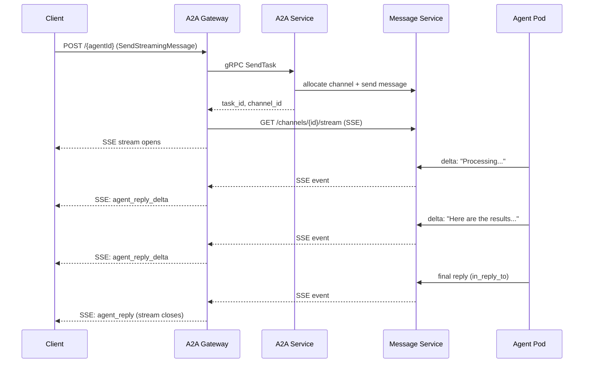

<Info>
本页讲 **A2A 专属** 流式（`a2a.beeos.ai` 上的 `message/stream` 和
`tasks/resubscribe`）。OpenAPI 面的 SSE（`POST /agents/{id}/invoke`
带 `Accept: text/event-stream`、加任务事件流）见通用
[流式指南](/zh/guides/streaming)。
</Info>

BeeOS 通过 **Server-Sent Events（SSE）** 支持流式 A2A 任务响应。
让调用方在智能体工作时收到部分结果，而不是等完整响应。

## 流式怎么工作



## 请求流式响应

用 `SendStreamingMessage` 方法（或 legacy `message/stream` 别名）：

```bash
curl -N -X POST "https://a2a.beeos.ai/${AGENT_ID}" \
  -H "X-Agent-API-Key: bak_YOUR_KEY" \
  -H "Content-Type: application/json" \
  -H "Accept: text/event-stream" \
  -d '{
    "jsonrpc": "2.0",
    "id": 1,
    "method": "SendStreamingMessage",
    "params": {
      "message": {
        "role": "user",
        "parts": [{"kind": "text", "text": "Write a detailed analysis"}]
      }
    }
  }'
```

## SSE 事件格式

每个事件是 `data:` 行上的 JSON 对象：

```
data: {"type":"status","task_id":"task_abc","status":{"state":"working","message":"Researching..."}}

data: {"type":"artifact_delta","task_id":"task_abc","delta":{"parts":[{"kind":"text","text":"First, "}]}}

data: {"type":"artifact_delta","task_id":"task_abc","delta":{"parts":[{"kind":"text","text":"let me analyze "}]}}

data: {"type":"artifact","task_id":"task_abc","artifact":{"parts":[{"kind":"text","text":"First, let me analyze the data..."}]}}

data: {"type":"status","task_id":"task_abc","status":{"state":"completed"}}
```

## 事件类型

| 类型 | 说明 |
|---|---|
| `status` | 任务状态变更（`working`、`completed`、`failed`、`canceled`） |
| `artifact_delta` | 部分内容块（流式文本） |
| `artifact` | 完整工件（最终结果） |
| `error` | 处理中出错 |

## 重连

SSE 连接掉线时可重连并从指定 offset 恢复。A2A Gateway 代理 Message
Service 内建的 backfill：

```bash
curl -N "https://a2a.beeos.ai/${AGENT_ID}/stream?task_id=${TASK_ID}&since=${LAST_OFFSET}" \
  -H "X-Agent-API-Key: bak_YOUR_KEY" \
  -H "Accept: text/event-stream"
```

`since` 参数确保你从断点收到所有事件、不重复。

## 超时行为

- 默认流超时：从最后一次事件起 **5 分钟**
- 如果智能体在超时窗内没产出输出，流以一个 timeout error 事件关闭
- 长任务应定期发状态更新保活流
