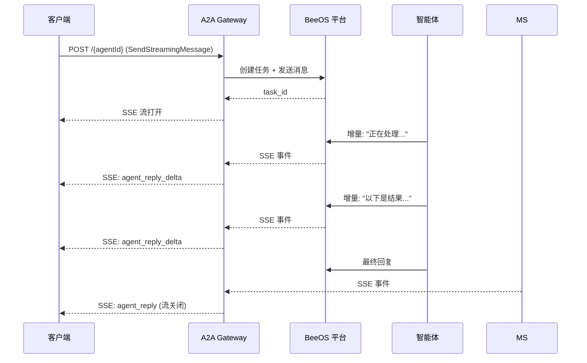

BeeOS 支持通过 **Server-Sent Events (SSE)** 流式传输 A2A 任务响应。
调用方可以在智能体处理过程中实时接收部分结果，而无需等待完整响应。

## 流式传输原理



## 请求流式响应

使用 `SendStreamingMessage` 方法（或遗留别名 `message/stream`）：

```bash
curl -N -X POST "https://a2a.beeos.ai/${AGENT_ID}" \
  -H "X-Agent-API-Key: bak_YOUR_KEY" \
  -H "Content-Type: application/json" \
  -H "Accept: text/event-stream" \
  -d '{
    "jsonrpc": "2.0",
    "id": 1,
    "method": "SendStreamingMessage",
    "params": {
      "message": {
        "role": "user",
        "parts": [{"kind": "text", "text": "写一篇详细分析"}]
      }
    }
  }'
```

## SSE 事件格式

每个事件是 `data:` 行上的 JSON 对象：

```
data: {"type":"status","task_id":"task_abc","status":{"state":"working","message":"正在研究..."}}

data: {"type":"artifact_delta","task_id":"task_abc","delta":{"parts":[{"kind":"text","text":"首先，"}]}}

data: {"type":"artifact_delta","task_id":"task_abc","delta":{"parts":[{"kind":"text","text":"让我分析 "}]}}

data: {"type":"artifact","task_id":"task_abc","artifact":{"parts":[{"kind":"text","text":"首先，让我分析数据..."}]}}

data: {"type":"status","task_id":"task_abc","status":{"state":"completed"}}
```

## 事件类型

| 类型 | 说明 |
|------|------|
| `status` | 任务状态变更（`working`、`completed`、`failed`、`canceled`） |
| `artifact_delta` | 部分内容块（流式文本） |
| `artifact` | 完整产物（最终结果） |
| `error` | 处理过程中发生错误 |

## 重连

如果 SSE 连接中断，可以从指定偏移量重连恢复：

```bash
curl -N "https://a2a.beeos.ai/${AGENT_ID}/stream?task_id=${TASK_ID}&since=${LAST_OFFSET}" \
  -H "X-Agent-API-Key: bak_YOUR_KEY" \
  -H "Accept: text/event-stream"
```

`since` 参数确保从断连点接收所有事件，不会产生重复。

## 超时行为

- 默认流超时：从最后一个事件起 **5 分钟**
- 如果智能体在超时窗口内未产生任何输出，流将以超时错误事件关闭
- 长时间运行的任务应定期发送状态更新以保持流活跃
