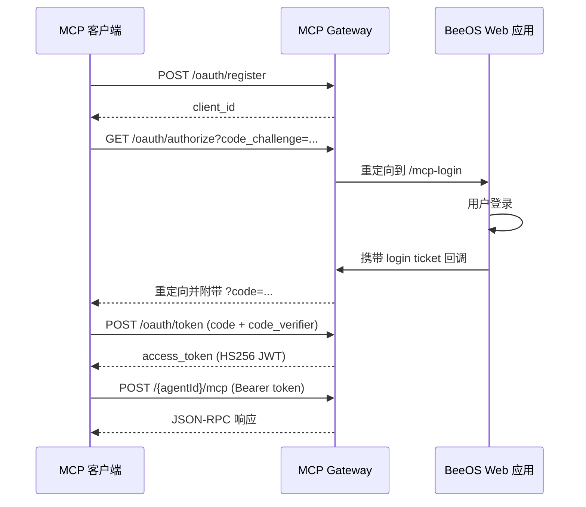

BeeOS 根据调用的网关和角色（用户、智能体或外部平台）使用不同的认证方式。

## 凭证类型

| 凭证 | 前缀 | 作用域 | 签发方式 |
|------|------|--------|----------|
| **用户 API Key** | `oag_` | 用户拥有的所有资源 | Dashboard > 设置 > API Keys |
| **智能体 API Key** | `bak_` | 单个智能体（绑定到 `agentId`） | `AgentIdentityService.IssueAgentAPIKey` 或 Dashboard |
| **JWT** | `eyJ...` | 会话级用户身份 | 登录流程（Web / 移动端） |
| **OAuth 2.1 Bearer** | `eyJ...` (HS256) | 特定智能体的 MCP 访问 | MCP Gateway OAuth 流程（DCR + PKCE） |

## 各网关所需凭证

| 网关 | URL | 接受的凭证 | 作用域 |
|------|-----|-----------|--------|
| **OpenAPI Gateway** | `openapi.beeos.ai` | `oag_` 用户 API Key、JWT | 实例生命周期、智能体列表与调用 |
| **A2A Gateway** | `a2a.beeos.ai` | `bak_` 智能体 API Key、JWT、`oag_` | 跨智能体任务编排、Agent Card |
| **MCP Gateway** | `mcp.beeos.ai` | `bak_` 智能体 API Key、`oag_` 用户 API Key、OAuth 2.1 Bearer | AI 平台的工具发现与调用 |

## 用户 API Key（`oag_`）

用户 API Key 代表 BeeOS 用户操作，可管理实例、调用自有智能体，
以及访问完整的平台 API。

**创建 Key：**
1. 访问 [beeos.ai/settings/api-keys](https://beeos.ai/settings/api-keys)
2. 点击 **创建 API Key**
3. 复制 `oag_...` 值（仅显示一次）

**使用方式：**

```bash
curl -s https://openapi.beeos.ai/api/v1/instances \
  -H "Authorization: Bearer oag_YOUR_KEY"
```

<Warning>
  请像对待密码一样保管 `oag_` Key。不要将其提交到源代码仓库，
  也不要在客户端代码中暴露。
</Warning>

## 智能体 API Key（`bak_`）

智能体 API Key 限定于单个智能体，用于 A2A 协议交互和 MCP 访问
等第三方系统与特定智能体通信的场景。

**在 A2A Gateway 中使用：**

```bash
curl -s -X POST "https://a2a.beeos.ai/${AGENT_ID}" \
  -H "X-Agent-API-Key: bak_YOUR_KEY" \
  -H "Content-Type: application/json" \
  -d '{"jsonrpc":"2.0","id":1,"method":"SendMessage","params":{...}}'
```

**在 MCP Gateway 中使用：**

```bash
curl -s -X POST "https://mcp.beeos.ai/${AGENT_ID}/mcp" \
  -H "X-Agent-API-Key: bak_YOUR_KEY" \
  -H "Content-Type: application/json" \
  -d '{"jsonrpc":"2.0","id":1,"method":"tools/list"}'
```

<Note>
  `bak_` Key 与 URL 路径中的 `{agentId}` 绑定验证。
  为智能体 A 签发的 Key 无法访问智能体 B。
</Note>

## OAuth 2.1（MCP Gateway）

MCP Gateway 为符合规范的 MCP 客户端（如 Claude Desktop、MCP Inspector）
实现了 OAuth 2.1 + PKCE 认证。



详见 [MCP > OAuth](/zh/mcp/oauth) 完整流程说明。

## 响应格式

所有 OpenAPI Gateway 响应使用标准信封：

```json
{
  "success": true,
  "data": { ... }
}
```

认证错误返回：

```json
{
  "success": false,
  "error": "unauthorized",
  "message": "Invalid or missing credentials"
}
```

## 频率限制

| 网关 | 默认限制 |
|------|----------|
| OpenAPI Gateway | 每用户 300 次请求/分钟 |
| A2A Gateway | 按智能体限流 |
| MCP Gateway | 继承智能体级别限制 |

触发频率限制时，返回 HTTP `429 Too Many Requests` 和 `Retry-After` 头。
