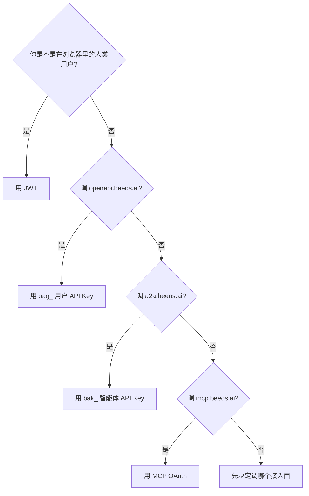

每个 BeeOS 公开端点都需要认证。共有 **4 种**凭证类型，按你调用的
协议接入面选择，而不是按 SDK 语言。挑选与所打的 host 匹配的那个：

| 凭证 | Header | 适用 host | 签发方 |
|---|---|---|---|
| **用户 JWT** | `Authorization: Bearer <jwt>` | `gateway.beeos.ai`（Web / 移动端 / 桌面）**和** `openapi.beeos.ai`（SDK） | 用户登录（Gateway `POST /api/v1/auth/login`） |
| **用户 API Key (`oag_`)** | `Authorization: Bearer oag_...` | **仅** `openapi.beeos.ai`（SDK） | 用户自助签发（Gateway） |
| **智能体 API Key (`bak_`)** | `Authorization: Bearer bak_...` | **仅** `a2a.beeos.ai`（A2A JSON-RPC） | 智能体拥有者（Gateway） |
| **MCP OAuth** | `Authorization: Bearer <oauth-access-token>` | **仅** `mcp.beeos.ai`（MCP） | 与 Gateway 完成 OAuth 流程 |

两组 host 在凭证体系上**完全分离**，这是有意的：SDK 调用方不必关心
JWT 续期，A2A / MCP 客户端也不会意外抓到用户的会话 cookie。

---

## 1. 用户 JWT —— Web / 移动端 / 桌面会话

由主 Gateway（`gateway.beeos.ai`，本地 `:9080`）在登录时签发。短期
有效（通常 1 小时，SDK / Web 客户端会自动续期）。授予该用户名下全部资源
的完整访问权 —— 凡是用户在 Web UI 能做的操作，用 JWT 都能做。

```http
POST /api/v1/auth/login        ← Gateway，不是 openapi-gw
Content-Type: application/json

{ "email": "you@example.com", "password": "..." }
```

响应里包含 `access_token`；以 `Authorization: Bearer <jwt>` 形式
发往 Gateway（Web 流量）或 `openapi.beeos.ai`（SDK 流量 —— 接受同一个 JWT）。

JWT **仅用于**交互式会话。对于 backend cron、CI 或任何把凭证落盘的
场景，请用 `oag_` Key —— JWT 会过期，无头脚本里轮转 refresh token
的麻烦远大于收益。

---

## 2. `oag_` —— 用户 API Key（SDK 调用）

SDK 调用方实际传的凭证。由用户自助签发，不需要管理员介入。

```http
POST /api/v1/api-keys            ← Gateway
Authorization: Bearer <user-jwt>
Content-Type: application/json

{
  "name": "my-cron-job",
  "rate_limit_per_minute": 600,
  "expires_at": "2027-05-01T00:00:00Z"
}
```

响应里包含**明文** Key（`oag_<64-hex>`），**只显示一次**；立即妥善
保存。Gateway 服务端只留 SHA-256 hash。

### 格式

```
oag_   ────────────────────────────────────────────
↑      ↑
固定    32 字节随机数的 hex 编码（64 字符）
```

前 12 个字符（`oag_<8 hex>`）作为 `key_prefix` 单独存储，可在列表 /
审计日志里安全展示。

### 鉴权

`oag_` User API Key 是 **user-scoped** 的：每个 Key 绑定到唯一
owner，并自动获得该 owner 名下全部资源的访问权。所有路由都由 handler
内的 owner-ACL 守门 —— 不管调用方用哪种凭证，跨租户访问一律拒绝。

API 表面**已经没有** per-route scope 词汇了。旧版本要求在签发 Key
时显式声明 `agents:read` / `tasks:write` 之类的 scope，未授权则
返回 `403 insufficient_scope` —— 该网关已被移除（迁移说明见下方
[v1.1.0 changelog 段](#scope-removal-v1-1-0)）。验证通过的 `oag_`
Key 在鉴权上的行为等同于其所属用户的 JWT。

<a id="scope-removal-v1-1-0" />
<Note>
**从 v1.1.0 之前的 SDK 迁移。** 如果你之前用
`createAPIKey(name, scopes, ...)` 或 `POST /api/v1/api-keys` 时带了
`scopes` body 字段，请去掉该参数 —— 已签发的 Key 自动获得 owner 全权限。
`403 insufficient_scope` 错误码不再下发；建议合并到通用的 403 /
`forbidden` 处理逻辑。
</Note>

### 列出 / 吊销

```http
GET    /api/v1/api-keys              ← Gateway，列出你的所有 Key
DELETE /api/v1/api-keys/{id}         ← Gateway，吊销
```

**没有专门的 rotation 接口** —— 通过签发新 Key、切换调用方、再吊销
老 Key 完成轮换。（P2-D 落地后请参见
[Versioning & Deprecation](#) 了解推荐的过渡窗口。）

---

## 3. `bak_` —— 智能体 API Key（A2A JSON-RPC）

供**外部智能体**（或别家组织的系统）通过 `a2a.beeos.ai` 上的
A2A 协议**调用你的智能体**。绑定到单个智能体（不是用户）。每个智能体
**最多同时持有 3 个**活跃 Key。

```http
POST /api/v1/agents/{agentId}/keys   ← Gateway（不是 openapi-gw）
Authorization: Bearer <agent-owner-jwt>
Content-Type: application/json

{ "name": "partner-integration-acme-corp" }
```

### 格式

```
bak_   ────────────────────────────────────────────
↑      ↑
固定    32 字节随机数的 hex 编码（64 字符）
```

### 列出 / 吊销

```http
GET    /api/v1/agents/{agentId}/keys                ← Gateway
DELETE /api/v1/agents/{agentId}/keys/{keyId}        ← Gateway
```

### 为什么用独立前缀？

`bak_` Key **没有 scope 体系**，**没有用户身份** —— 它是一个智能体
调用 token。A2A Gateway 认证 Key、解析出智能体拥有者、然后以**该智能体**
的身份放行请求。`oag_` 和 `bak_` 命名空间混用会让这层映射含糊。
参见
[`a2a.beeos.ai` 智能体集成契约](https://github.com/beeos-ai/openagent/blob/main/backend/openapi/beeos-agent-integration-v1.yaml)。

---

## 4. MCP OAuth —— Model Context Protocol 客户端

`mcp.beeos.ai` 是一个 [Model Context Protocol](https://modelcontextprotocol.io)
host。MCP 客户端（Claude Desktop、Cursor、自定义 MCP server）通过
MCP 标准 discovery 文档定位授权服务器，然后完成一个短小的 OAuth 2.0
authorization-code 流程；拿到的 access token **仅在** `mcp.beeos.ai`
有效 —— 在 `openapi.beeos.ai` 和 `a2a.beeos.ai` 上都不工作。

正常情况下你不需要手写这段流程 —— MCP 客户端帮你完成。如果你在
开发新的 MCP 客户端，请参考
[MCP 认证规范](https://spec.modelcontextprotocol.io/specification/basic/authorization)。

---

## 怎么选



请参考 [选择协议](/zh/guides/choosing-a-protocol) 获取完整对比
（host、wire 格式、scope 单位、streaming / async / push 语义、
配套示例）。

要决定"我到底该打哪个协议接入面"，请先看
[`zh/guides/choosing-a-protocol`](/zh/guides/choosing-a-protocol)。

---

## 常见错误

- **在 `a2a.beeos.ai` 上用 `oag_`** —— A2A Gateway 会以
  `401 unauthorized` 拒绝。两组 host 在凭证状态上**有意零共享**。
- **把 `oag_` Key 嵌进发布的移动端 / 桌面端二进制** —— 用户的 Key
  归用户，不归你的应用。Web 应用应该让用户登录（JWT）、由你的后端用
  服务端 `oag_` 完成后端工作。
- **指望按路由的 scope 拦截** —— `agents:*` / `tasks:*` / `files:*` /
  `instances:*` scope 词汇已在 v1.1.0 移除。`oag_` Key 是
  user-scoped，handler 里的 owner-ACL 是唯一鉴权门。
- **指望从 openapi-gw 轮换 Key** —— 轮换 / 吊销在主 Gateway（见上文
  端点）。OpenAPI Gateway 对凭证元数据是只读的，不暴露
  `POST /api-keys`。

---

## 各凭证在代码中的校验位置

| 凭证 | 校验器位置 | 备注 |
|---|---|---|
| 用户 JWT | [`backend/pkg/infrastructure/authclient/middleware.go`](https://github.com/beeos-ai/openagent/blob/main/backend/pkg/infrastructure/authclient/middleware.go) 的 `Authenticate` | 用 RSA 公钥校验 RS256 JWT |
| `oag_` | [`backend/pkg/infrastructure/authclient/middleware.go`](https://github.com/beeos-ai/openagent/blob/main/backend/pkg/infrastructure/authclient/middleware.go) 的 `Authenticate` → Auth Service gRPC `LookupAPIKey` | SHA-256 hash 与 `api_keys.key_hash` 比对 |
| `bak_` | A2A Gateway `auth/agent_api_key.go` → Agent Identity gRPC `LookupAgentAPIKey` | SHA-256 hash 与 `agent_api_keys.key_hash` 比对 |
| MCP OAuth | MCP Gateway 内置 OAuth provider | 按 MCP 规范 |

---

## 另请参阅

- [调用智能体](/zh/guides/calling-agents) —— 拿到凭证后如何实际发起 SDK 调用
- [OpenAPI 契约](https://github.com/beeos-ai/openagent/blob/main/backend/openapi/beeos-platform-v1.yaml) —— 你能用 `oag_` 调的路由
- [A2A 外部集成](https://github.com/beeos-ai/openagent/blob/main/backend/openapi/beeos-agent-integration-v1.yaml) —— 接受 `bak_` 的路由
- [ADR 001 —— openapi-gateway 作为唯一 OpenAPI 实现者](https://github.com/beeos-ai/openagent/blob/main/backend/docs/adr/001-openapi-gateway-bff.md)
