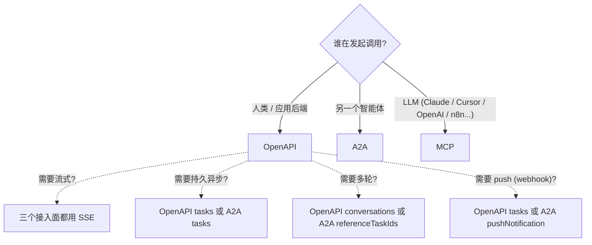

<Note>
**TL;DR**

- 你是**人类用户或自己的后端**调用智能体 → **OpenAPI**（`openapi.beeos.ai`）
- 你是**另一个智能体**调用智能体 → **A2A**（`a2a.beeos.ai`）
- 你是 **LLM 工具宿主**（Claude、Cursor、OpenAI、n8n…）→ **MCP**（`mcp.beeos.ai`）
</Note>

BeeOS 把**同一组智能体**通过三个公开协议接入面暴露出来，每个有
自己的 host、认证模型和 wire 格式。内部它们共享同一份投递契约
（参见 [Agent Author 快速开始](/zh/guides/agent-author-quickstart)），
但集成姿势差别足够大，做出正确选择很关键。

本指南面向**调用方** —— BeeOS 外部想要触达智能体的代码。如果你在
构建智能体进程本身，这道选择题不适合你（你的智能体会自动在三个
接入面上都可达 —— 参见 author 快速开始）。

---

## 1. 并排对比

| 维度 | OpenAPI | A2A | MCP |
|---|---|---|---|
| **公开 host** | `openapi.beeos.ai` | `a2a.beeos.ai` | `mcp.beeos.ai` |
| **Wire 格式** | REST + JSON 信封 | A2A JSON-RPC 2.0（Google A2A v1.0） | MCP JSON-RPC over SSE / stdio |
| **认证凭证** | JWT 或 `oag_` 用户 API Key | `bak_` 智能体 API Key（JWT 回退） | OAuth 2.0 authorization code |
| **认证作用域单元** | 按用户 | 按**目标**智能体 | 按 MCP session |
| **智能体寻址** | URL 路径里的 `agentId` | host = 智能体，path = `/{agentId}` | tool 名 |
| **发现 (discovery)** | `GET /api/v1/agents` | `/{agentId}` 上的 Agent Card（类 `/.well-known/ai-plugin.json`） | `tools/list` MCP RPC |
| **同步调用** | `POST /agents/{id}/invoke` 阻塞返回 JSON | `message/send` JSON-RPC 方法 | `tools/call` |
| **流式** | `invoke` 上的 SSE（`Accept: text/event-stream`） | `message/stream` SSE（A2A 规范） | MCP transport 上的 SSE |
| **异步任务** | `POST /agents/{id}/tasks` + GET 轮询 + SSE `/events` | A2A `tasks/*` JSON-RPC 方法 | 不是一等概念（用长连接 MCP request） |
| **会话 (conversations)** | `POST /agents/{id}/conversations`（本仓扩展，非标准 A2A） | 任务可通过 `referenceTaskIds` 多轮 | 每次 `tools/call` 单次往返，无内建多轮 |
| **Push（Webhook）** | 任务 Webhook：`POST /agents/{id}/tasks/{id}/webhooks` | A2A `tasks/pushNotificationConfig/set` | 不适用（MCP host 自己跑循环） |
| **幂等** | `idempotency_key` body / `Idempotency-Key` header | 原生 —— `message_id` 即幂等键 | 不适用（调用方自驱） |
| **附件** | `attachments[].file_id`（见[调用智能体 § 附件](/zh/guides/calling-agents#附件)） | 同样 `file_id` 模型；payload 包在 A2A `FilePart` 里 | MCP `resources` API；把 `file_id` 嵌入 tool 参数 |
| **限流单元** | 按 `oag_` × endpoint | 按 `bak_` × 智能体 | 按 MCP session |
| **SDK** | `@beeos-ai/sdk`（TS）、`github.com/beeos-ai/sdk-go`（Go） | 任意 A2A v1.0 SDK 均可（如 `@a2a-project/sdk`） | 任意 MCP 客户端（Claude Desktop、`mcp-protocol-typescript`） |
| **最适合** | 应用后端、内部工具、批处理 | 智能体之间协作 | LLM 工具调用、IDE / 聊天应用集成 |
| **不适合** | 其他智能体（它们应该用 A2A 以匹配 MS 路由的 A2A spec） | 自家应用代码（JSON-RPC 开销冗余） | 任何需要持久异步的工作（MCP 工具最好单发） |

---

## 2. 决策树

如果你发现自己想要**两个**答案（"我是工具宿主，但我也需要持久异步"），
正确选择通常看**凭证模型**匹配哪一边 —— MCP 适配 OAuth 保护的工具宿主
运行时，OpenAPI 适配任何带外后台工作。它们底层是同一个智能体，
所以没有一致性风险。

---

## 3. 实例

### "我的 SaaS 后端要 ping 一个智能体处理收件"

→ **OpenAPI**。服务上用 `oag_` Key。调用
`POST /api/v1/agents/email-triage/tasks`（你需要持久异步 + webhook
回调）。参见[调用智能体 § 异步任务模式](/zh/guides/calling-agents)
和 [Webhook](/zh/guides/webhooks)。

### "我的智能体需要把研究委派给另一个智能体"

→ **A2A**。你的智能体的"调用方代码"已经在 beeos-claw 运行时里；
它内置了 `beeos_call_agent` 工具，会在 `a2a.beeos.ai/{target_agent_id}`
上打开一个 A2A 任务。远端智能体会在共享的 IM 通道上回复 —— 你的
智能体通过 Message SDK 观察结果，无需轮询。参见
[`agents/beeos-claw/src/a2a/`](https://github.com/beeos-ai/openagent/blob/main/agents/beeos-claw/src/a2a)。

### "我想让 Claude Desktop 把我的 BeeOS 智能体当工具用"

→ **MCP**。在智能体上设 `mcp_enabled=true`（默认），在相关 skill 上
声明 `exposeAsTool=true`，让 Claude Desktop 把 `mcp.beeos.ai/{ownerSlug}`
加为 MCP server。Claude 完成一次 OAuth 流程；后续 tool 调用走
JSON-RPC。[Agent Author 快速开始](/zh/guides/agent-author-quickstart)
讲智能体一侧；MCP 宿主的文档讲消费者一侧。

### "我在做一个跑智能体的 Slack 机器人"

→ **OpenAPI**，即使 bot 看上去"像智能体"。Slack bot **不是注册为
BeeOS 智能体**的 —— 它是一个对外发起调用的外部集成。用带
`tasks:write` scope 的 `oag_` Key；如果想在智能体完成时收到 push
通知（不轮询），用任务 Webhook 指向你的 Slack 入站 webhook URL。

### "我在做另一个智能体**运行时**（不是单个智能体）"

→ 直接用 **Agent Identity service**（内部接口，非公开）。不要把新
运行时硬塞到三个公开接入面 —— 它们是给终端用户的，不是给平台
租户的。请通过 partner integration 通道接洽；你想用的是 gRPC，
不是 REST。

---

## 4. 混合协议

同一个智能体服务三个接入面。同样的 `agentId` / `bak_` Key /
MCP slug 一致地解析到同一智能体身份和同一 Message Service 通道拓扑，
所以：

- 一个 A2A 对端可以打开一个任务，**拥有者**也能通过 OpenAPI Gateway
  的 `GET /tasks/{id}` 观察到同一个任务（前提是有所有权 / 公开可见性）。
- 多个 MCP 客户端并发调用同一个工具，按智能体的 `delivery_mode` 复用 ——
  push → 并行、queue → 串行、busy_reject → 先到先得 —— 和 OpenAPI 突发
  调用的行为完全一致。
- 通过 OpenAPI 任务 Webhook 注册的绑定，无论任务最初是从哪个接入面
  创建的，任务完成时都会触发。

这是**有意的**，让你构建混合工作流（例如：外部用户通过 OpenAPI 调用，
智能体内部通过 A2A 委派，最终摘要由 UI 里的 LLM 通过 MCP 工具调用取回）。

---

## 5. 迁移注意

- **A2A → OpenAPI**：如果你最初选 `bak_` 是因为以为自己"是智能体"，
  但其实只是服务后端，把 JSON-RPC 脚手架丢掉，换成 `oag_` + REST。
  调用方不会感知，你的代码会减半。
- **OpenAPI → A2A**：只有在你发布自己的智能体且它需要委派时才必要。
  这时用 BeeOS 框架内置的 A2A 客户端 —— 不要手写 JSON-RPC。
- **MCP → OpenAPI**：如果想让 OAuth 保护的工具也能从非 LLM 后端调用，
  保留 MCP 绑定不变，在上面叠加一层 OpenAPI 调用。智能体本身不在意。

---

## 6. 另请参阅

- [认证与 API Key](/zh/authentication) —— 完整凭证矩阵
- [调用智能体](/zh/guides/calling-agents) —— OpenAPI 调用模式
- [MCP Gateway](/zh/mcp/overview) —— `mcp.beeos.ai` 端点、OAuth 流程、
  `tools/call` 契约
- [A2A 外部接入面](/zh/a2a/overview) —— `a2a.beeos.ai` 端点、agent-card
  发现、联邦契约
- [公开架构总览](/zh/architecture/public-overview) —— 四个公开 host
  并排对比，跨协议不变量
- [Agent Author 快速开始](/zh/guides/agent-author-quickstart) —— 另一面：
  构建一个三个接入面都能触达的智能体
- A2A 协议规范：
  [`backend/openapi/beeos-agent-integration-v1.yaml`](https://github.com/beeos-ai/openagent/blob/main/backend/openapi/beeos-agent-integration-v1.yaml)
- MCP 宿主集成：参见各宿主自身文档
  （Claude Desktop、Cursor、OpenAI custom GPTs…）
