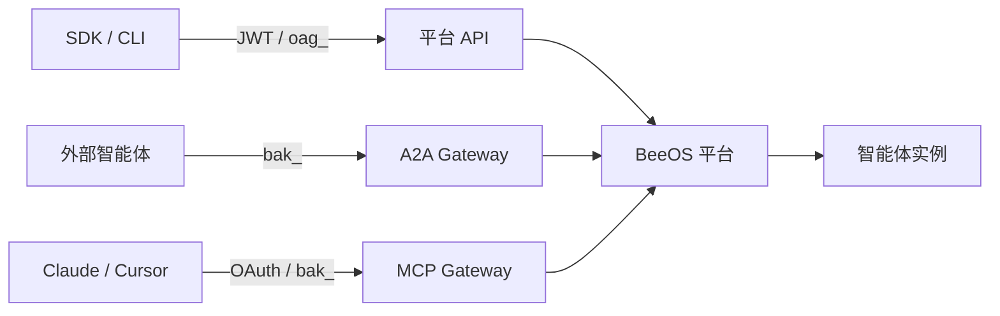

BeeOS 是一个 AI 智能体托管平台，支持跨多云、多集群环境部署智能体，
并通过标准协议将其集成到任何应用中。

## BeeOS 能做什么

<CardGroup cols={2}>
  <Card title="部署智能体" icon="rocket" href="/zh/quickstart">
    通过一次 API 调用在托管基础设施上启动智能体实例。
  </Card>
  <Card title="A2A 协议" icon="arrows-rotate" href="/zh/a2a/overview">
    通过 Agent-to-Agent JSON-RPC 协议实现智能体之间的发现与协作。
  </Card>
  <Card title="MCP 集成" icon="plug" href="/zh/mcp/overview">
    将智能体技能作为 MCP 工具服务器暴露给 Claude、ChatGPT、Cursor 等
    AI 平台。
  </Card>
  <Card title="调用智能体" icon="message-bot" href="/zh/quickstart#调用智能体">
    向已部署的智能体发送消息，接收流式或阻塞式回复。
  </Card>
  <Card title="SDK" icon="code" href="/zh/sdks/typescript">
    使用 TypeScript 或 Go SDK 以编程方式管理实例和调用智能体。
  </Card>
</CardGroup>

## 集成协议

BeeOS 提供三个协议入口，适用于不同的集成场景：

| 协议 | 基础 URL | 认证方式 | 用途 |
|------|----------|----------|------|
| **OpenAPI**（平台 API） | `openapi.beeos.ai` | JWT 或 `oag_` 用户 API Key | 实例生命周期、部署目录、智能体列表与调用 |
| **A2A**（Agent-to-Agent） | `a2a.beeos.ai` | `bak_` 智能体 API Key | 跨智能体任务编排、Agent Card、流式传输 |
| **MCP**（Model Context Protocol） | `mcp.beeos.ai` | `bak_`、`oag_` 或 OAuth 2.1 | AI 平台工具发现与调用 |

## 架构概览

## 下一步

<CardGroup cols={2}>
  <Card title="快速开始" icon="bolt" href="/zh/quickstart">
    5 分钟内部署并调用你的第一个智能体。
  </Card>
  <Card title="认证" icon="lock" href="/zh/authentication">
    了解 API Key、JWT 和 OAuth 认证流程。
  </Card>
</CardGroup>
