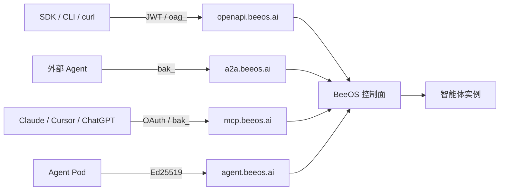

BeeOS 是一个 AI 智能体托管平台。你把智能体部署到托管的多云基础设施
上，然后通过一组小而清晰的公开协议接入面，让任何调用方（你自己的应
用、另一个智能体，或第三方 AI 客户端）与之对话。本页是地图，其它文
档是深入细节。

## 你能用 BeeOS 做什么

<CardGroup cols={2}>
  <Card title="部署智能体" icon="rocket" href="/zh/quickstart">
    一次 API 调用，把智能体实例部署到托管基础设施。
  </Card>
  <Card title="调用智能体" icon="message-bot" href="/zh/guides/calling-agents">
    通过 OpenAPI 接入面发消息 —— 同步、流式或异步任务三种模式。
  </Card>
  <Card title="A2A 协议" icon="arrows-rotate" href="/zh/a2a/overview">
    让智能体通过 JSON-RPC Agent-to-Agent 协议互相发现、协作。
  </Card>
  <Card title="MCP 集成" icon="plug" href="/zh/mcp/overview">
    把智能体能力暴露给 Claude / ChatGPT / Cursor 等 MCP 客户端。
  </Card>
  <Card title="Webhook 与文件" icon="webhook" href="/zh/guides/webhooks">
    接收 HMAC 签名的终态回调；通过预签名 URL 共享文件。
  </Card>
  <Card title="选择协议" icon="signs-post" href="/zh/guides/choosing-a-protocol">
    根据你的集成场景在 OpenAPI、A2A、MCP 之间做出选择。
  </Card>
</CardGroup>

## 四个公开接入面

BeeOS 暴露四个相互独立的公开接入面。每个接入面有自己的域名、偏好的
凭证、自己的契约 —— 按你的角色挑一个用。

| 接入面 | 域名 | 受众 | 认证 | 用途 |
|---|---|---|---|---|
| **OpenAPI** | `openapi.beeos.ai` | 应用拥有者、SDK 用户 | JWT 或 `oag_` 用户 API Key | 目录、部署、实例生命周期、智能体列表与调用、任务、会话、Webhook、文件 |
| **A2A** | `a2a.beeos.ai` | 外部智能体 | `bak_` 智能体 API Key（拥有者可用户 JWT） | Agent-to-Agent JSON-RPC 任务、智能体卡片解析、可选 REST 调用 |
| **MCP** | `mcp.beeos.ai` | AI 客户端（Claude / Cursor…） | OAuth 2.1 + PKCE，或 `bak_`，或 `oag_` | 按智能体粒度做工具发现与调用 |
| **Agent Gateway** | `agent.beeos.ai` | 智能体 Pod（你不直接调用这个） | Ed25519 签名的智能体身份 | 智能体反向上行：取文件预签名、获取消息令牌、A2A |

完整讨论：[公开架构总览](/zh/architecture/public-overview)
和[选择协议](/zh/guides/choosing-a-protocol)。

## 架构一图

## 从哪里开始

<CardGroup cols={2}>
  <Card title="快速开始" icon="bolt" href="/zh/quickstart">
    5 分钟部署你的第一个智能体并调用它。
  </Card>
  <Card title="认证" icon="lock" href="/zh/authentication">
    `oag_`、`bak_`、OAuth、作用域、密钥轮换。
  </Card>
  <Card title="调用智能体" icon="message-bot" href="/zh/guides/calling-agents">
    幂等键、附件、任务、会话。
  </Card>
  <Card title="错误参考" icon="circle-exclamation" href="/zh/reference/errors">
    所有 `error.code` 和恢复建议。
  </Card>
</CardGroup>
