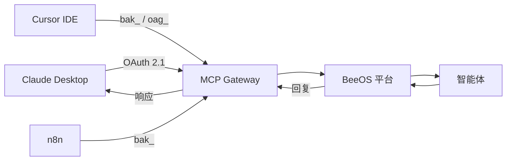

**Model Context Protocol（MCP）** 集成允许外部 AI 平台发现并调用 BeeOS
智能体技能作为标准 MCP 工具。任何支持 MCP Streamable HTTP 传输的平台
都可以连接 — 包括 Claude Desktop、ChatGPT、Cursor、n8n 和 MCP Inspector。

## 架构



## MCP 端点

```
POST https://mcp.beeos.ai/{agentId}/mcp
```

这是一个 Streamable HTTP 端点，按照 MCP 规范接受 JSON-RPC 2.0 请求。

## 认证

MCP 端点接受三种凭证类型（按优先级排序）：

| 方式 | 头部 | 最佳场景 |
|------|------|----------|
| 智能体 API Key | `X-Agent-API-Key: bak_...` | 按智能体的第三方集成 |
| 用户 API Key | `Authorization: Bearer oag_...` | 脚本、CI、自动化以用户身份执行 |
| OAuth 2.1 Bearer | `Authorization: Bearer <JWT>` | 符合规范的 MCP 客户端（Claude Desktop） |

详见 [MCP OAuth](/zh/mcp/oauth) 完整 OAuth 2.1 + PKCE 流程。

## 快速开始

### 列出可用工具

```bash
curl -s -X POST "https://mcp.beeos.ai/${AGENT_ID}/mcp" \
  -H "X-Agent-API-Key: bak_YOUR_KEY" \
  -H "Content-Type: application/json" \
  -d '{
    "jsonrpc": "2.0",
    "id": 1,
    "method": "tools/list"
  }' | jq
```

响应：

```json
{
  "jsonrpc": "2.0",
  "id": 1,
  "result": {
    "tools": [
      {
        "name": "web_search",
        "description": "搜索网络信息",
        "inputSchema": {
          "type": "object",
          "properties": {
            "query": {"type": "string", "description": "搜索查询"}
          },
          "required": ["query"]
        }
      }
    ]
  }
}
```

### 调用工具

```bash
curl -s -X POST "https://mcp.beeos.ai/${AGENT_ID}/mcp" \
  -H "X-Agent-API-Key: bak_YOUR_KEY" \
  -H "Content-Type: application/json" \
  -d '{
    "jsonrpc": "2.0",
    "id": 2,
    "method": "tools/call",
    "params": {
      "name": "web_search",
      "arguments": {"query": "最新 AI 新闻"}
    }
  }' | jq
```

## Claude Desktop 配置

在 `~/Library/Application Support/Claude/claude_desktop_config.json` 中添加：

```json
{
  "mcpServers": {
    "beeos-agent": {
      "transport": "streamable-http",
      "url": "https://mcp.beeos.ai/YOUR_AGENT_ID/mcp"
    }
  }
}
```

Claude 首次连接时会自动完成 OAuth 流程（DCR、authorize、token）。
认证后，`tools/list` 和 `tools/call` 将透明工作。

## tools/call 底层原理

MCP `tools/call` 是一个同步聊天往返，使用与 [A2A REST 调用](/zh/a2a/rest-invoke)
相同的消息传输机制：

1. MCP Gateway 将工具调用转换为消息并发送给智能体
2. 智能体处理请求并返回回复
3. Gateway 将回复作为 JSON-RPC 结果返回

MCP 调用 **不会** 创建 A2A 任务，没有任务生命周期开销。

## 支持的 JSON-RPC 方法

| 方法 | 说明 |
|------|------|
| `tools/list` | 列出智能体暴露的所有工具 |
| `tools/call` | 调用特定工具 |
| `resources/list` | 列出可用资源 |
| `resources/read` | 读取特定资源 |
| `prompts/list` | 列出提示模板 |
| `prompts/get` | 获取特定提示模板 |

详见 [工具](/zh/mcp/tools) 和 [资源](/zh/mcp/resources) 方法文档。

## 下一步

<CardGroup cols={2}>
  <Card title="OAuth 流程" icon="key" href="/zh/mcp/oauth">
    为符合规范的 MCP 客户端配置 OAuth 2.1 + PKCE。
  </Card>
  <Card title="工具" icon="wrench" href="/zh/mcp/tools">
    工具发现与调用参考。
  </Card>
  <Card title="资源" icon="database" href="/zh/mcp/resources">
    智能体暴露的只读数据资源。
  </Card>
</CardGroup>
